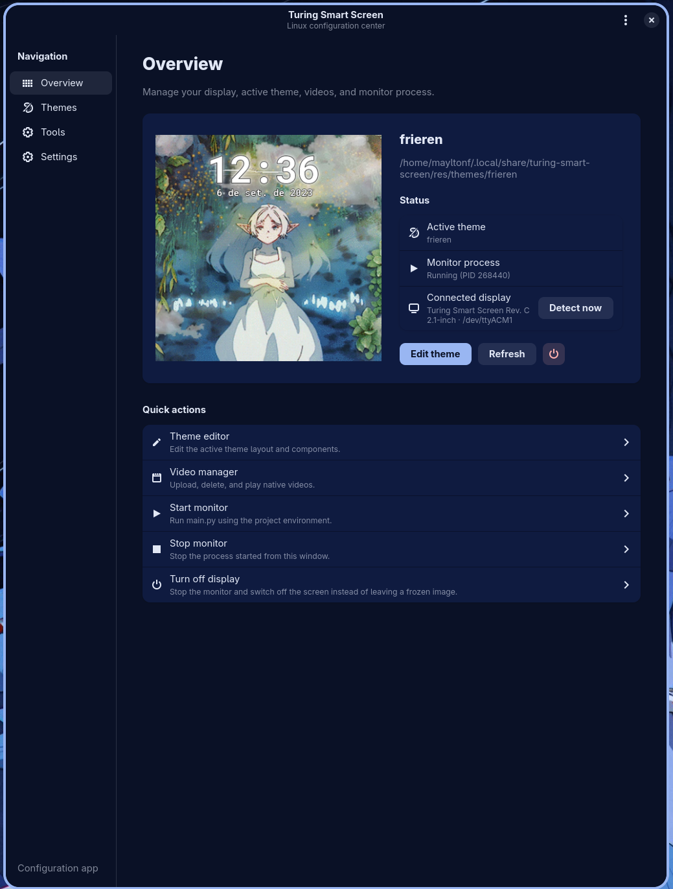
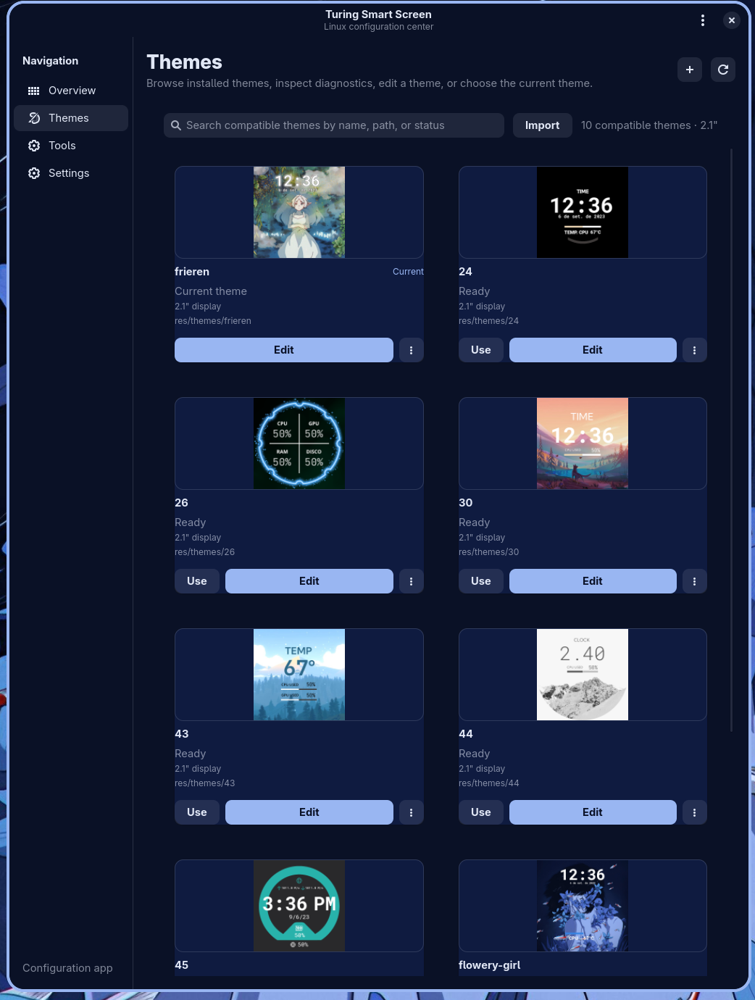
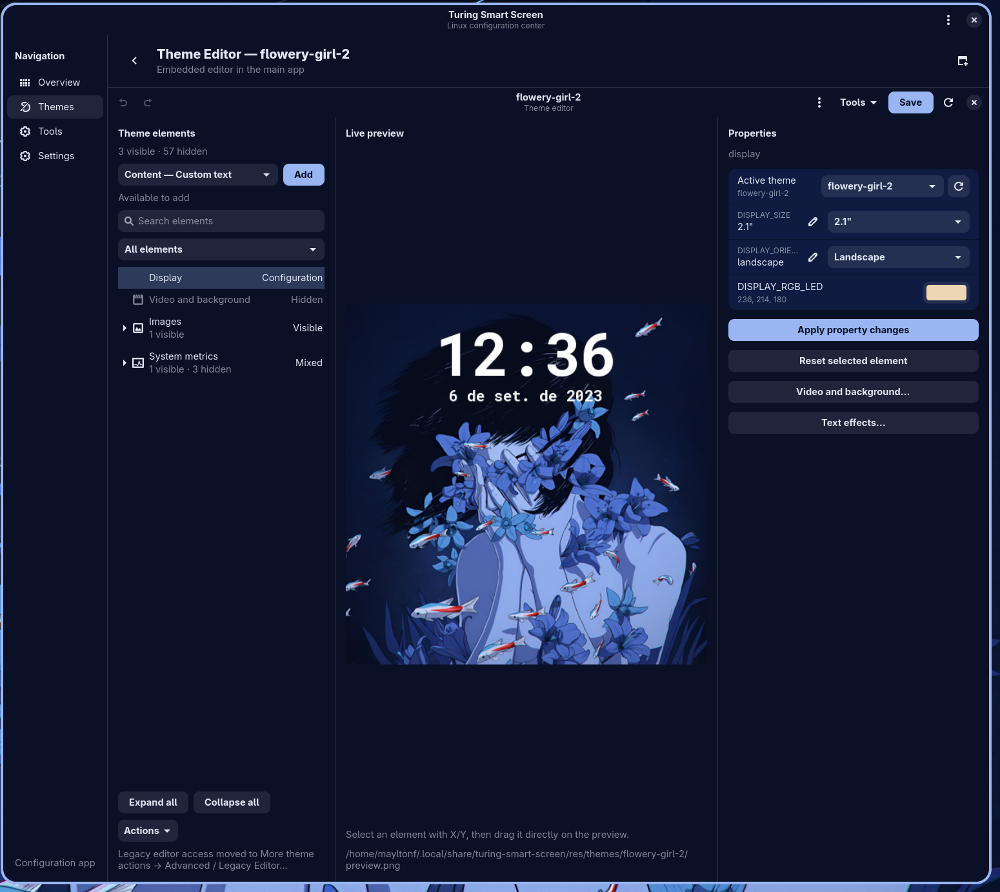

# Turing Smart Screen Linux GTK Fork

<p align="center">
  <strong>An experimental Linux desktop fork of <code>turing-smart-screen-python</code></strong><br />
  GTK4/Libadwaita app shell · Theme Gallery · media preparation · Rev. C video/storage experiments
</p>

<p align="center">
  
  
  
  
</p>

---

## What is this?

<!-- MAYLTON_FORK_OVERVIEW -->

This repository is a **Linux-focused experimental fork** of
[`mathoudebine/turing-smart-screen-python`](https://github.com/mathoudebine/turing-smart-screen-python).

The original project is a cross-platform Python system monitor and display
abstraction library for small USB-C smart screens. This fork explores a more
integrated **Linux desktop application** experience around that foundation:

- GTK4/Libadwaita app shell;
- visual Theme Gallery / Theme Manager;
- embedded Theme Editor;
- embedded Video Manager;
- media preparation tools for GIF/video inputs;
- generated-media tracking;
- theme import/export with preflight checks;
- Linux installer readiness diagnostics;
- experimental native video/storage workflows for tested Rev. C hardware.

This is **not** the official vendor software and it is **not** the upstream
project. It is a public experimental fork shared so other users and upstream
maintainers can inspect the direction, reuse ideas, or discuss possible smaller
contributions later.

---

## Screenshots

<p align="center">
  
  
</p>

<p align="center">
  
</p>

<p align="center">
  <em>Overview, Theme Gallery, and embedded Theme Editor running on Linux.</em>
</p>

---

## Current public app branch

The full GTK app-shell work currently lives on:

```text
feature/theme-video-inspector-live-preview
```

Until that work is promoted to `main`, install from the active branch:

```bash
git clone --branch feature/theme-video-inspector-live-preview \
  https://github.com/maylton/turing-smart-screen-video-overlay.git

cd turing-smart-screen-video-overlay
./install.sh --check-only
./install.sh
turing-smart-screen
```

The repository's `main` branch is currently used as the public landing/default
branch, so this README intentionally points users to the active app branch.

---

## Important safety notice

> [!WARNING]
> This fork was developed through a heavily **AI-assisted / vibe-coded**
> workflow. Many changes were tested in small iterations, but the code has not
> gone through a traditional upstream maintainer review process. Use it at your
> own risk.

Be especially careful with features that interact with real hardware state:

- media upload;
- device-side delete operations;
- video playback/stop commands;
- display power/control flows;
- storage/media management;
- any command that writes to the connected device.

Before testing, keep backups of custom themes, configuration files, and local
media. Read commands before running them.

---

## Validation scope

The inherited monitor/theme functionality comes from the upstream project and may
work with the same general families of supported devices. The **new fork-specific
media/video/storage work** is much more limited.

| Area | Status |
| --- | --- |
| Linux GTK app shell | Implemented in the active app branch |
| Theme Gallery / Theme Manager | Implemented in the active app branch |
| Embedded Theme Editor | Implemented in the active app branch |
| Embedded Video Manager | Implemented in the active app branch |
| Theme import/export | Implemented in the active app branch |
| Export preflight | Implemented in the active app branch |
| Installer `--check-only` diagnostics | Implemented in the active app branch |
| Native Rev. C video/storage workflow | Experimental; validated on one device profile |
| Broad hardware validation | Not complete |
| Broad non-Arch packaging validation | Not complete |

### Tested hardware for fork-specific media features

| Device/profile | Validation |
| --- | --- |
| Turing Smart Screen Rev. C 2.1-inch, ROM 88 | Physically validated by the fork author |
| Native video playback/storage management | Validated on the Rev. C 2.1-inch profile above |
| Other Turing/TURZX sizes/revisions | Not guaranteed for fork-specific media operations |
| XuanFang / Kipye / WeAct / other devices | Inherited monitor support may work, but fork-specific media flows are not guaranteed |

---

## Why this fork exists

The upstream project is powerful, cross-platform, and scriptable. This fork asks
a different question:

> What would a Linux-first, GTK-native desktop app for these displays feel like?

The answer explored here is an app that keeps the YAML/theme foundations while
adding a more guided desktop workflow:

- manage themes visually;
- edit themes without losing YAML control;
- prepare images/videos without writing FFmpeg commands manually;
- track generated media instead of overwriting source files;
- validate exports before sharing themes;
- make device access and installer readiness easier to diagnose on Linux.

---

## Feature overview

### Linux GTK app shell

The main launcher is:

```bash
turing-smart-screen
```

The app shell brings together overview, quick actions, settings, theme
management, editing, and video/media tools in one GTK4/Libadwaita desktop
application.

### Theme Gallery / Theme Manager

The Theme Gallery provides a visual entry point for themes:

- theme cards and preview thumbnails;
- active/current theme markers;
- compatibility and diagnostics indicators;
- open/edit actions;
- duplicate, rename, and delete with confirmation;
- import from folder/archive;
- export to `.zip` archive;
- export preflight warnings for missing/generated/outside assets.

### Embedded Theme Editor

The editor keeps the YAML-first model while adding safer workflows:

- guarded saves;
- Undo/Redo-friendly operations;
- external file change detection;
- atomic writes;
- semantic element navigation;
- layer ordering;
- image layout/transform/crop inspectors;
- text/effect presets;
- generated-media tracking.

### Media preparation

The media preparation workflow helps convert GIF/video inputs into device-ready
outputs:

- source analysis with FFprobe;
- fit/fill/stretch/original/custom framing;
- trim controls;
- rotation/mirroring/crop style workflows;
- output preview;
- profile-aware dimensions;
- guarded upload path for validated hardware.

### Native video/storage experiments

For the validated Rev. C 2.1-inch workflow, the fork includes experimental tools
for:

- listing display-side media;
- checking size/storage information;
- uploading prepared media;
- playing and stopping video;
- deleting media with guarded flows;
- rendering transparent overlays above native video backgrounds.

This is the most hardware-specific and risky area of the fork.

---

## Release readiness validation

Before publishing or promoting a branch, run the release-readiness helper:

```bash
./scripts/verify-release-readiness.sh
```

This check is intended to catch packaging, documentation, test, and install-readiness regressions before a release candidate is shared.

---

## Installer readiness diagnostics

Before installing, run:

```bash
./install.sh --check-only
```

This mode is designed to be non-destructive. It reports:

- detected Linux distribution and package manager;
- dependency hints for common distro families;
- Python/venv readiness;
- GTK4/Libadwaita imports;
- Pillow, PyYAML, and ruamel.yaml availability;
- installed virtual-environment health when present;
- whether the launcher directory is in `PATH`;
- connected serial/USB devices under `/dev/ttyACM*`, `/dev/ttyUSB*`, and
  `/dev/serial/by-id/*`;
- real device owner/group/mode;
- whether the current user belongs to the required access group.

Different distributions use different serial-device groups. For example,
Arch/CachyOS often uses `uucp`, while Debian/Ubuntu commonly uses `dialout`.
The readiness check reports the actual group exposed by your connected device.

---

## Relationship with upstream

This fork is based on and deeply indebted to
[`mathoudebine/turing-smart-screen-python`](https://github.com/mathoudebine/turing-smart-screen-python).

This repository is **not** a request to merge the whole fork upstream as-is. The
fork is intentionally broad, Linux-first, and experimental. If upstream maintainers
or users find parts of it useful, those parts can be discussed and split into
small, focused, upstream-friendly pull requests later.

Likely upstream-friendly areas:

- small bug fixes;
- pure helper functions;
- diagnostics improvements;
- packaging/test improvements;
- isolated hardware findings;
- documentation clarifications.

Likely fork-specific areas for now:

- the full GTK4/Libadwaita app shell;
- Theme Gallery as implemented here;
- generated-media policy tied to this editor;
- Linux-only installer workflow;
- Rev. C native video/storage flows until upstream agrees on scope.

---

## Development process disclosure

This fork was built through iterative, AI-assisted development. In practice, that
means many changes were designed, generated, tested, reviewed, and refined in
small loops.

That process helped move quickly, but it does **not** remove the need for careful
human review. Treat this project as experimental unless you have reviewed and
tested the pieces you plan to use.

---

## Documentation

Most detailed documentation currently lives on the active app branch:

```text
feature/theme-video-inspector-live-preview
```

Useful documents there include:

- `docs/INSTALLATION.md`
- `docs/ROADMAP_CURRENT_STATUS.md`
- `docs/ROADMAP.md`
- `docs/OFFICIAL_WINDOWS_PARITY_ROADMAP.md`
- `docs/THEME_APP_ARCHITECTURE_CHECKPOINT.md`
- `docs/MEDIA_PREPARATION.md`
- `docs/UPSTREAM_SHARING.md`
- `CHANGELOG.md`

---

## Suggested upstream sharing message

If introducing this fork upstream, a good framing is:

```markdown
Hi! First of all, thank you for turing-smart-screen-python.

I have been working on an experimental Linux-focused fork that builds on top of
this project and explores a GTK4/Libadwaita desktop workflow.

The fork includes Theme Gallery / Theme Manager, embedded editor/video manager,
media preparation tools, generated-media tracking, theme import/export with
preflight validation, installer diagnostics, and experimental Rev. C video/storage
support validated on my 2.1-inch device.

This is not a request to merge the whole fork as-is. I am sharing it in case any
ideas, implementation details, or hardware findings are useful for the upstream
project.
```

---

## Credits

Original project:

- <https://github.com/mathoudebine/turing-smart-screen-python>

This fork would not exist without the upstream project's Python display
abstraction, theme model, hardware support, documentation, and community work.

---

## Disclaimer

This project is **not affiliated, associated, authorized, endorsed by, or in any
way officially connected with Turing / XuanFang / Kipye brands**, or any of their
subsidiaries, affiliates, manufacturers, or sellers. All product and company
names are trademarks or registered trademarks of their respective owners.

This project is an open-source alternative software experiment, not the original
software provided for the smart screens. Do not open issues here for vendor
applications such as `USBMonitor.exe` or `ExtendScreen.exe`, or for hardware
warranty support.

For vendor or hardware support, use the manufacturer/reseller channels.

---

## License

This fork follows the license of the upstream project. See [LICENSE](LICENSE).
