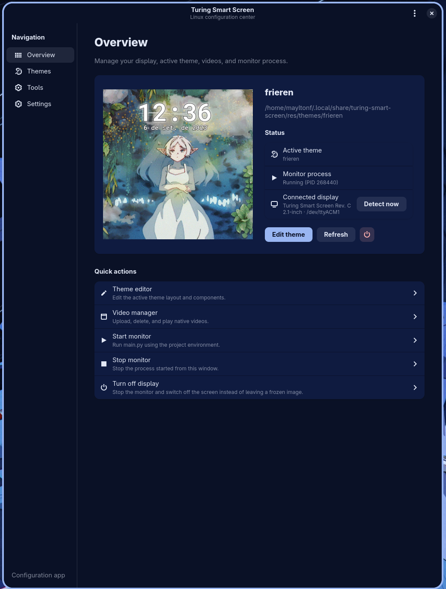
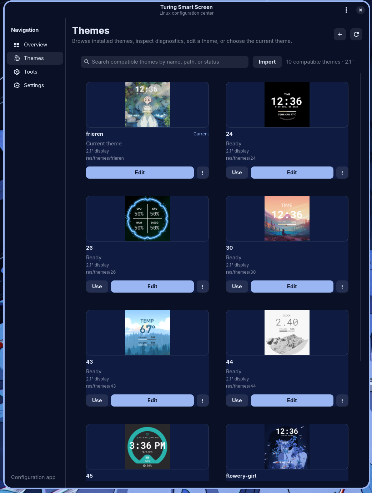
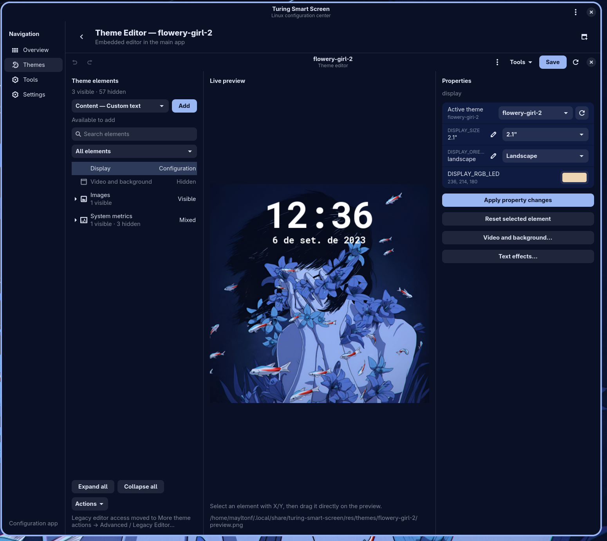

# Turing Smart Screen for Linux

<p align="center">
  <strong>A Linux-first GTK4/Libadwaita desktop application for Turing Smart Screen-compatible displays</strong><br />
  Theme Gallery · Theme Editor · HTML/YAML themes · native video workflows · system monitoring
</p>

<p align="center">
  
  
  
  
</p>

---

## What is this?

This repository is a Linux-focused fork of
[`mathoudebine/turing-smart-screen-python`](https://github.com/mathoudebine/turing-smart-screen-python),
built around a GTK4/Libadwaita desktop experience while keeping the upstream
Python display and theme foundations.

The application brings the most common workflows into one interface:

- start, stop and monitor the connected display;
- automatically detect compatible hardware;
- browse and activate themes from a visual Theme Gallery;
- edit YAML themes with an embedded Theme Editor;
- run HTML themes and transparent overlays;
- prepare GIF/video media for compatible displays;
- manage native video on validated Rev. C hardware;
- inspect system telemetry, including AMD GPU metrics on Linux;
- keep monitor execution available from the system tray.

The project is **not official vendor software** and is not maintained by the
upstream project.

---

## Screenshots

<p align="center">
  
  
</p>

<p align="center">
  
</p>

<p align="center">
  <em>Overview, Theme Gallery, and embedded Theme Editor running on Linux.</em>
</p>

---

## Latest stable release: 0.9.0

Version **0.9.0** is the first stable GitHub-distributed Flatpak build of this
fork. The `main` branch is now the canonical source for the application.

The release includes:

- `Turing-Smart-Screen-0.9.0-x86_64.flatpak` — installable Flatpak bundle;
- `70-turing-smart-screen.rules` — host udev permissions for supported USB/serial hardware;
- `SHA256SUMS` — checksums for the release assets.

See the [GitHub Releases page](https://github.com/maylton/turing-smart-screen-video-overlay/releases).

### Quick Flatpak install

Download the `.flatpak` bundle and `70-turing-smart-screen.rules` from the
release, then install the host hardware rule:

```bash
sudo install -Dm0644 \
  70-turing-smart-screen.rules \
  /etc/udev/rules.d/70-turing-smart-screen.rules

sudo udevadm control --reload-rules
sudo udevadm trigger
```

Reconnect the display after installing the rule.

Make sure Flathub is available for the GNOME runtime dependency, then install the
bundle:

```bash
flatpak remote-add --user --if-not-exists \
  flathub \
  https://flathub.org/repo/flathub.flatpakrepo

flatpak install --user ./Turing-Smart-Screen-0.9.0-x86_64.flatpak
```

Launch it with:

```bash
flatpak run io.github.turing.SmartScreen
```

> [!NOTE]
> The Flatpak sandbox can expose the device, but it cannot install udev rules on
> the host. The host rule is therefore a separate release asset and remains
> necessary on systems where the device does not already receive suitable
> `uaccess` permissions.

For source/native installation and troubleshooting, see
[`docs/INSTALLATION.md`](docs/INSTALLATION.md).

---

## Hardware validation

The upstream project supports multiple families of small USB displays. This fork
inherits much of that support, but fork-specific features have a narrower
physical validation scope.

| Area | Current status |
| --- | --- |
| Linux GTK4/Libadwaita app | Stable in 0.9.0 |
| Flatpak x86_64 packaging | Stable GitHub release |
| Theme Gallery / Theme Manager | Implemented |
| Embedded Theme Editor | Implemented |
| HTML themes / overlays | Implemented |
| System tray control | Implemented |
| AMD GPU telemetry in Flatpak | Validated with app-local libdrm |
| Native Rev. C video/storage | Physically validated on one 2.1-inch profile |
| Broad hardware-family validation | Ongoing |
| Flathub distribution | Not submitted yet |

### Physically validated fork-specific profile

| Device/profile | Validation |
| --- | --- |
| Turing Smart Screen Rev. C 2.1-inch, ROM 88 | Physically validated |
| Native video playback/storage management | Validated on the profile above |
| HTML theme + native video overlay | Validated on the profile above |
| Raw USB reset/recovery permissions in Flatpak | Validated with host udev rules |
| Other Turing/TURZX revisions and sizes | Monitor support may work; media operations are not guaranteed |
| XuanFang / Kipye / WeAct / other devices | Inherited support may work; fork-specific media operations are not guaranteed |

---

## Main features

### GTK desktop app

The Overview provides display state, active theme, detected hardware, monitor PID
and quick actions. The monitor can keep running while the main window is hidden,
and the tray exposes display controls without requiring the window to stay open.

### Theme Gallery

The visual gallery supports:

- preview cards and current-theme state;
- compatibility information;
- import from folders, `.theme` packages and legacy archives;
- duplicate, rename and delete flows;
- export with preflight checks for missing or generated assets.

### Embedded Theme Editor

The editor keeps themes editable as project files while adding safer desktop
workflows:

- guarded/atomic saves;
- external change detection;
- element navigation and layer ordering;
- image transforms and crop controls;
- text/effect presets;
- generated-media tracking.

### HTML themes and overlays

HTML themes run through the embedded WebKit renderer and can be combined with
native video on supported hardware. Authoring details live in
[`docs/HTML_THEME_AUTHORING_GUIDE.md`](docs/HTML_THEME_AUTHORING_GUIDE.md) and
[`docs/HTML_OVERLAY_DOCUMENT.md`](docs/HTML_OVERLAY_DOCUMENT.md).

### Media and native video

The media workflow can inspect source media with FFprobe, prepare device-sized
outputs, preview framing, and manage compatible native video storage. Hardware-
writing operations remain intentionally limited to validated profiles.

### AMD GPU telemetry in Flatpak

The 0.9.0 Flatpak bundles a current libdrm and builds `pyamdgpuinfo` from source
against the app-local libraries. This avoids the private manylinux libdrm copies
that previously looked for a missing `/usr/share/libdrm/amdgpu.ids` inside the
sandbox.

---

## Source installation

Flatpak is the recommended installation method for normal users. Developers and
users who prefer a native per-user installation can still clone `main`:

```bash
git clone https://github.com/maylton/turing-smart-screen-video-overlay.git
cd turing-smart-screen-video-overlay

./install.sh --check-only
./install.sh

turing-smart-screen
```

The native installer preserves user configuration, custom themes and local media
on updates by default. See [`docs/INSTALLATION.md`](docs/INSTALLATION.md) for the
full workflow.

---

## Development and validation

Before publishing changes, run the release-readiness helper:

```bash
./scripts/verify-release-readiness.sh
```

For Flatpak work, the repository also contains
[`packaging/flatpak/README.md`](packaging/flatpak/README.md) and a GitHub Actions
workflow that builds the repository, smoke-checks the exported app, creates a
single-file bundle and validates that `pyamdgpuinfo` is not using its bundled
manylinux `libdrm` copies.

---

## Important safety notice

> [!WARNING]
> Features that write to real display storage or change hardware state should be
> treated carefully. Fork-specific native media operations have not been
> physically validated across every supported display family.

Keep backups of custom themes/configuration and review commands before using
hardware-writing utilities. Ambiguous display detection is not used to silently
reconfigure the device.

---

## Development process disclosure

This fork has been developed through an iterative, heavily AI-assisted workflow,
with changes tested and refined in small loops. That speeds up experimentation,
but does not replace hardware validation or human code review. Contributions and
independent testing are welcome.

---

## Documentation

Useful project documentation includes:

- [`docs/INSTALLATION.md`](docs/INSTALLATION.md)
- [`docs/DISPLAY_DETECTION.md`](docs/DISPLAY_DETECTION.md)
- [`docs/DISPLAY_LIFECYCLE.md`](docs/DISPLAY_LIFECYCLE.md)
- [`docs/GPU_SELECTION.md`](docs/GPU_SELECTION.md)
- [`docs/HTML_THEME_AUTHORING_GUIDE.md`](docs/HTML_THEME_AUTHORING_GUIDE.md)
- [`docs/HTML_OVERLAY_DOCUMENT.md`](docs/HTML_OVERLAY_DOCUMENT.md)
- [`docs/MEDIA_PREPARATION.md`](docs/MEDIA_PREPARATION.md)
- [`docs/THEME_PACKAGE_FORMAT.md`](docs/THEME_PACKAGE_FORMAT.md)
- [`docs/YAML_THEME_MIGRATION.md`](docs/YAML_THEME_MIGRATION.md)
- [`CHANGELOG.md`](CHANGELOG.md)

---

## Relationship with upstream

This fork is based on and deeply indebted to
[`mathoudebine/turing-smart-screen-python`](https://github.com/mathoudebine/turing-smart-screen-python).

The fork intentionally has a broader Linux desktop scope than upstream. Small,
self-contained fixes and hardware findings may still be suitable for upstream
contribution when they can be separated cleanly.

---

## Contributing

Bug reports, hardware validation results, documentation fixes and focused code
contributions are welcome. See [`CONTRIBUTING.md`](CONTRIBUTING.md) and use this
repository's [issue tracker](https://github.com/maylton/turing-smart-screen-video-overlay/issues).

When reporting hardware issues, include the display model/revision, USB IDs,
Linux distribution, installation type (Flatpak/native), and relevant logs.

---

## Disclaimer

This project is **not affiliated, associated, authorized, endorsed by, or in any
way officially connected with Turing / XuanFang / Kipye brands**, or any of their
subsidiaries, affiliates, manufacturers, or sellers. Product and company names
remain the property of their respective owners.

For vendor applications, firmware or warranty support, use the manufacturer or
reseller channels.

---

## License

This fork follows the upstream project's GPL-3.0-or-later license. See
[`LICENSE`](LICENSE).
